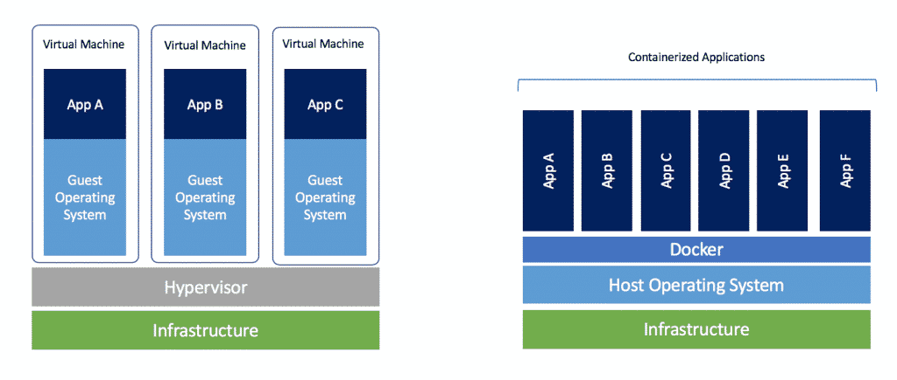
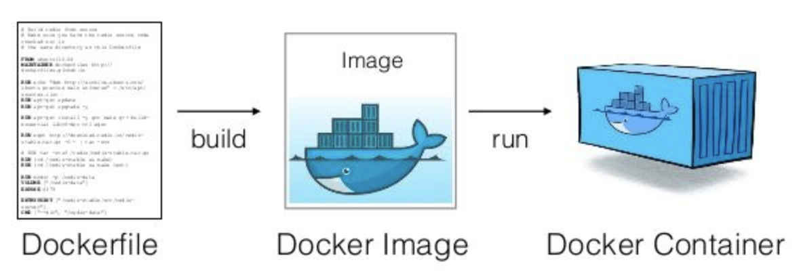

# DOCKER CRASH COURSE

Docker is a software framework for building, running, and managing containers on servers and the cloud.

## 🤔 Why Docker?

- Virtual machines virtualize hardware which seems to be slow and bulky
- Docker is faster since it only virtualizes operating system
- By using isolated containers, if it works here it will work anywhere

## 🛠 Installation

https://docs.docker.com/get-docker/

Simple and easy for Mac and Linux. For Windows, a subsystem for linux called WSL is required.

## 🐳 Workflow

## 📖 Chapters

1. What is Docker?
1. Installing Docker
1. Images & Containers
1. Parent Images & Docker Hub
1. The Dockerfile
1. dockerignore
1. Starting & Stopping Containers
1. Layer Caching
1. Managing Images & Containers
1. Volumes
1. Docker Compose
1. Dockerizing a React App
1. Sharing Images on Docker Hub
